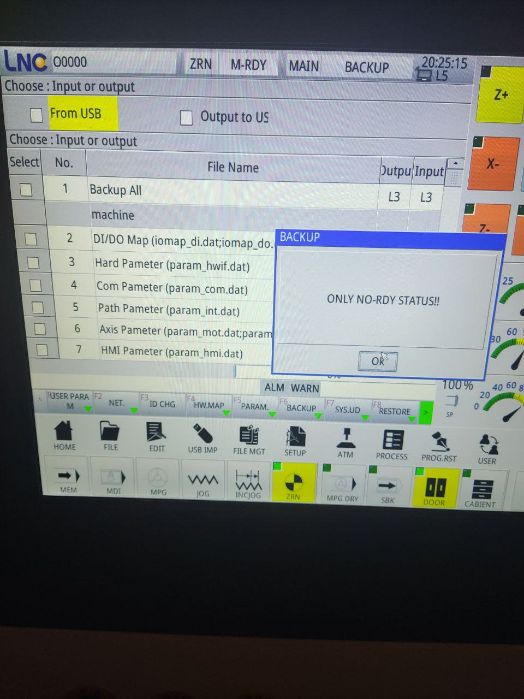

# LNC MW2200A CNC Controller Configuration

## Directory Overview

This directory contains a backup of the configuration and data files for an LNC MW2200A CNC controller. These files define the machine's parameters, HMI (Human-Machine Interface) layout, PLC (Programmable Logic Controller) logic, and other settings.

## Key Files

*   **`disk2/hmi/language_def/`**: Contains language files for the HMI. The `.str` files map UI element IDs to text in different languages.
*   **`disk3/data/open_custom_bottom/` and `disk3/data/open_extend_1/`**: These directories contain files that define the HMI layout, including images (`.png`), UI structure (`ohframe.xml`), and language strings (`.str`).
*   **`disk3/data/log/`**: Contains log files, such as `cncsys.txt` (system log) and `opmsg.txt` (operation messages).
*   **`disk4/machine/`**: This is the most critical directory, containing the core machine configuration files:
    *   **`param_define.txt`**: Defines the machine parameters, including their names, types, and valid ranges.
    *   **`param.txt`**: A text file listing the machine parameters and their current values.
    *   **`cnc.lpar`**: A binary file that likely stores the machine parameters in a more compact format.
    *   **`plc.prj`**: The project file for the PLC, which controls the machine's logic.
    *   **`keymap.ini`**: Defines the mapping of physical keys on the control panel to their functions.
    *   **`cnc_plc_*.str` and `hmi*.str`**: String files for different parts of the system.

## Usage

These files are intended for technicians and engineers who need to restore, modify, or troubleshoot the LNC MW2200A CNC controller.

*   **To restore the machine's configuration**, you would typically use the LNC software to load the files from these directories onto the controller.
*   **To modify the machine's parameters**, you can edit `param.txt` and then load it onto the controller. It is also possible to edit the parameters directly on the machine's HMI.
*   **To customize the HMI**, you can edit the `ohframe.xml` files and the associated images and string files.
*   **To modify the PLC logic**, you would need the appropriate LNC software to open and edit the `plc.prj` file.

## Keymap Configuration

Here's how to add new quick F vacuum/aspiration buttons:


   1. Identify the M-code. For example:
   2. Create a macro in `ohframe.xml`: Open the file disk3\data\open_custom_bottom\ohframe.xml (or the other ohframe.xml if the button is for another
      page) and add a new <Macro> entry in the <MacroList> section. The macro will execute the corresponding M-code.
  `xml
      <Macro Name="VacuumPump1On" Comment="Switch on vacuum pump 1">
          <Code>M(10);</Code>
          <Code>RET</Code>
      </Macro>
      `
      Example for macro "Vacuum pump 1 Off":
      `xml
      <Macro Name="VacuumPump1Off" Comment="Switching off vacuum pump 1">
          <Code>M(11);</Code>
          <Code>RET</Code>
      </Macro>
      `
      Example for macro "Dust Lid Lifting":
  `xml
      <Macro Name="DustCoverUp" Comment="Lifting the dust cover">
          <Code>M(140);</Code>
          <Code>RET</Code>
      </Macro>
      `


   3. In the same ohframe.xml file, add a new <QohButton> (or <QohLabel>) element at the desired location in the HMI page.
   1. Backup: Always back up ohframe.xml and any associated .str files before making changes.
   * VACUUM PUMP 1 ON: M10

**Caution:**  Please use extreme caution when modifying these files, as incorrect changes can cause the machine to malfunction. Always
  consult the official LNC documentation for your specific controller model.


**Caution:** Modifying these files without a thorough understanding of the LNC controller can lead to machine malfunction or damage. Always back up the original files before making any changes.


Moving from an LNC MW2200A controller to Mach3 is not just a software adjustment, but a significant change that requires:


   1. Hardware replacement. For Mach3, a compatible motion control board will be required (e.g. SmoothStepper, UC100) and possibly rewiring to the motor and sensor drivers.
  Is it necessary? If the LNC controller is working correctly and meets your needs, switching to Mach3 is optional. It is usually done for specific
   functionality requirements, preferences for the Mach3 interface, or when there are problems with the existing controller. This is a major undertaking that requires
  in-depth knowledge of electronics and CNC systems.

## Resetting Motor Positions After Gantry Displacement

**Question (БГ):** Има ли настройка която да ресетва моторите или тяхната позиция при разместване на портала?

**Answer:** Yes. When the gantry (portal) is physically displaced — for example due to a power loss, mechanical shock, or manual movement — the controller loses track of the motor positions. The correct way to restore accurate position tracking is to perform a **Return to Origin (Homing)** sequence. This resets all axis positions relative to the physical home switches.

### How It Works

The LNC MW2200A uses the following parameters to control the homing behaviour (found in `disk4/machine/param.txt`):

| Parameter | Axis | Current Value | Description |
|-----------|------|---------------|-------------|
| `77000`   | 1 (X) | `2` | Homing method: `2` = DOG + INDEX (uses home switch and encoder index pulse) |
| `77001`   | 2 (Y) | `2` | Homing method: `2` = DOG + INDEX |
| `77002`   | 3 (Z) | `2` | Homing method: `2` = DOG + INDEX |
| `77064`   | 1 (X) | `0` | Origin offset after homing (LU) |
| `77065`   | 2 (Y) | `0` | Origin offset after homing (LU) |
| `77066`   | 3 (Z) | `0` | Origin offset after homing (LU) |
| `56031.0` | 1 (X) | `0` | Set absolute machine coordinate after homing (`0`=off, `1`=on) |
| `56031.1` | 2 (Y) | `0` | Set absolute machine coordinate after homing (`0`=off, `1`=on) |
| `56031.2` | 3 (Z) | `0` | Set absolute machine coordinate after homing (`0`=off, `1`=on) |
| `56128`   | 1 (X) | `0` | Absolute coordinate value assigned after homing (LU) |
| `56129`   | 2 (Y) | `0` | Absolute coordinate value assigned after homing (LU) |
| `56130`   | 3 (Z) | `0` | Absolute coordinate value assigned after homing (LU) |
| `71496.x` | All  | `0` | Mechanical coordinate compensation when synchronized follow control starts (`0`=off, `1`=on) |

### Steps to Reset Motor Positions After Gantry Displacement

1. **Power on the machine** and wait for the controller to boot fully.
2. **Check the gantry position** visually. If the gantry or any axis is in an unexpected position and could cause a collision during homing, engage the Emergency Stop, manually move the affected axis to a safe starting position, then release the Emergency Stop before continuing.
3. **Navigate to the JOG / REF (Reference / Return to Origin) mode** on the HMI.
4. **Start the Return to Origin (REF) sequence** for all axes. The machine will move each axis toward its home switch and re-establish the zero position.
   - Axis 1 (X), Axis 2 (Y) and Axis 3 (Z) are configured to use **DOG + INDEX** homing (parameter `77000`–`77002` = `2`), which provides the most accurate and repeatable home position.
5. Once homing completes, all motor position counters are reset to the machine origin. The controller now has a known, accurate position for all axes.

### Gantry Squaring (Dual-Drive Y-Axis)

If the machine uses a **tandem (dual-motor) Y-axis** and the gantry has become physically skewed (one side displaced further than the other):

- Parameter **`71496.x`** (`同步追随控制启动时机械座标补偿`) controls whether the controller automatically compensates for the mechanical coordinate difference between the master and follower axis when synchronized follow control starts. Here `.x` is the zero-based axis bit index (e.g., `.0` = Axis 1, `.1` = Axis 2). Enable this (`1`) for the **follower Y axis** (the slave motor on the opposite side of the gantry from the master Y). This allows the controller to absorb the position offset electronically during homing, effectively squaring the gantry without manual mechanical adjustment.
- After enabling `71496.x` for the follower axis, perform the **Return to Origin** sequence. Each side of the gantry will home independently against its own home switch, correcting any skew.

**Note:** Always mechanically inspect the gantry after any displacement event before resuming cutting operations. A homing sequence corrects the position registers but does not fix physical damage to the machine structure.

## Complete to backup.tgz

To create a complete backup of the configuration files, you can use the following command:

```bash
tar -czvf backup.tgz disk1/ disk2/ disk3/ disk4/
```

This command will create a compressed archive named `backup.tgz` containing all the files from the specified directories.

## USB restore instructions
To restore the configuration files to the LNC MW2200A CNC controller using a USB drive, follow these steps:
1. **Prepare the USB Drive**:
   - Format a USB drive to FAT32 to ensure compatibility with the LNC controller.
   - Copy the backup files (e.g., `backup.tgz`) to the root directory of the USB drive.
2. **Change User Permissions Userlevel 5**
   - from the main screen, press the "User" button to change the user level to "Admin" or "Service" to gain access to system settings.
3. **Access the File Management Menu**:
   - Navigate to the "File Management" section in the system settings.
4. **Insert the USB Drive**:
   - Insert the prepared USB drive into the USB port on the LNC MW2200A CNC controller.
   - Press the emergency stop button.
5. **Backup before Restore**:
   - Before restoring, it is advisable to back up the current configuration. Use the file management menu to copy the existing configuration files to another location on the controller or to another USB drive.



[Telegram Group](https://t.me/lnc_mw2200a)
[YouTube Channel](https://www.youtube.com/@lnc_mw2200a)